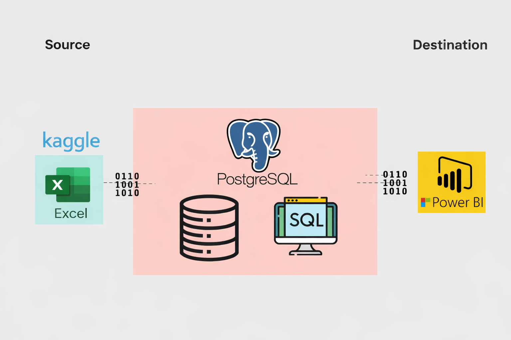

# Top_Indian_Youtubers_2024

  

This project analyzes the Top Indian YouTube channels in 2024 to support marketing collaboration and campaign planning using data driven insights. The objective was to identify high reach and high engagement YouTubers without relying on expensive third party tools or scattered online rankings.

The analysis is built on enriched and cleaned YouTube channel data, focusing on key metrics such as subscribers, views, videos, and engagement ratios. The final output is an interactive Power BI dashboard that allows users to easily explore top channels, compare subscribers vs views, apply Top N filtering, and understand engagement efficiency beyond just popularity.

The repository includes the Power BI dashboard file, dataset, documentation, and visuals so others can explore, learn, and build upon the analysis.

A practical example of turning YouTube data into clear, actionable insights for marketing and influencer decision-making using Power BI.

  

